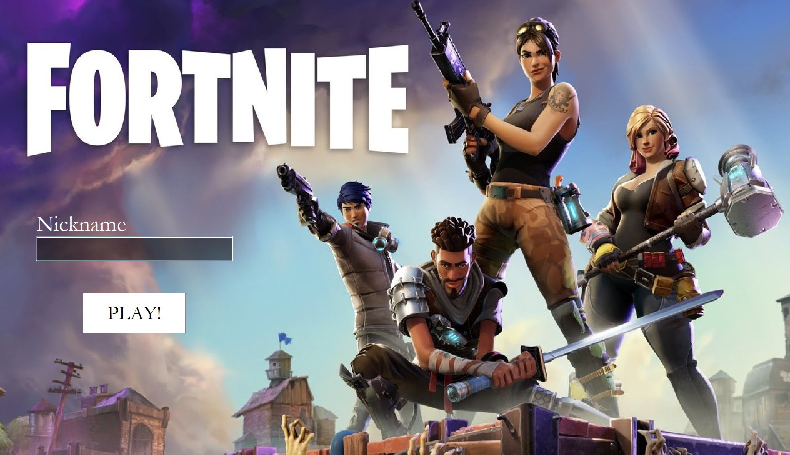
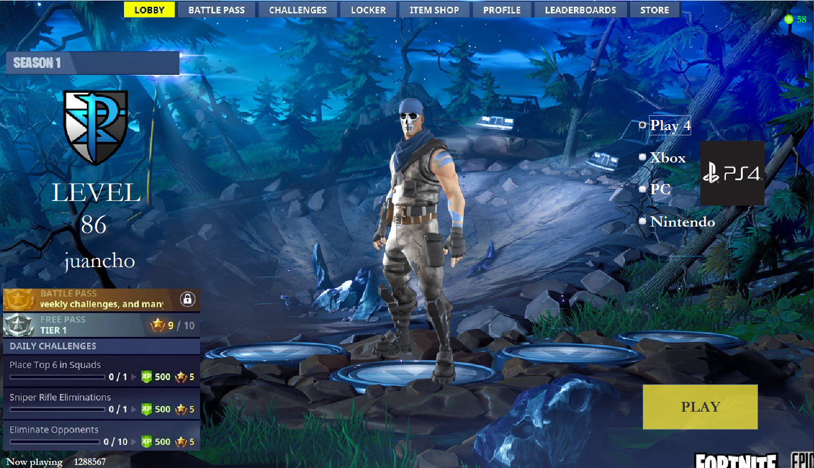
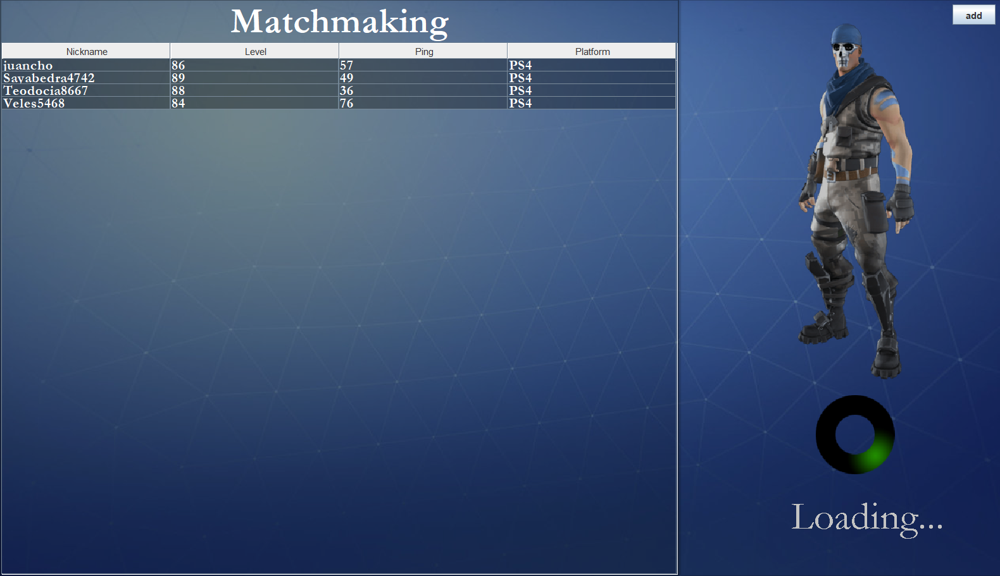
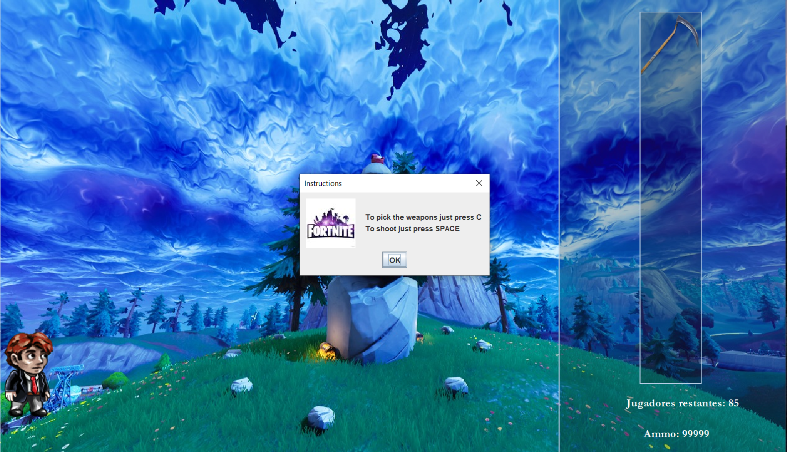
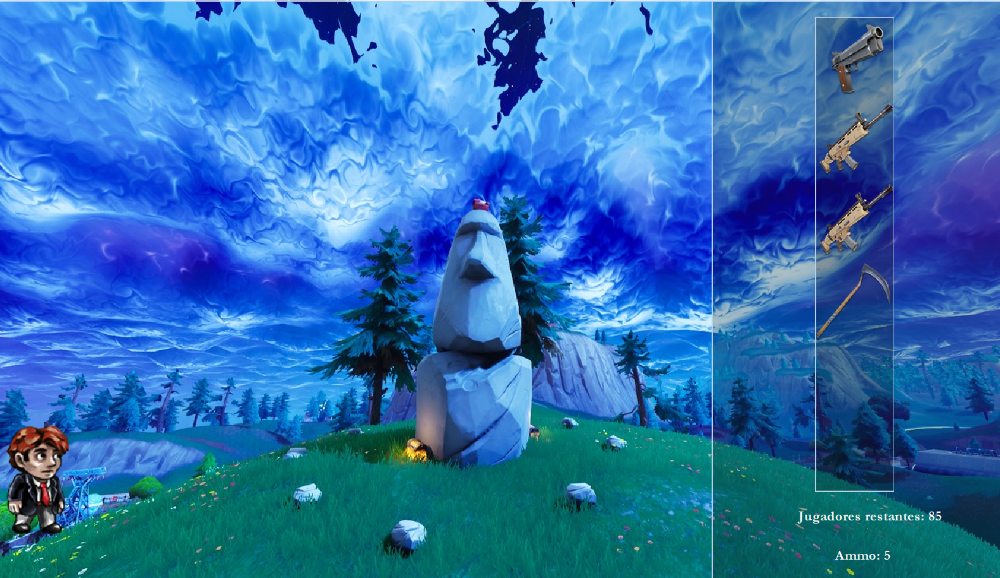
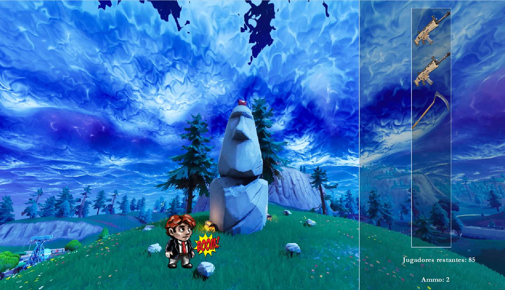

# Fornite Game - Stack Data Structure 

This project is a desktop application that shows how the data structure ***Stack*** works.

First there is a simple login.

Then the player enter to a lobby.

When the player selects a platform and press PLAY, the matchmaking starts.

To finish the matchmaking you can press the *add*  button.

There will be some instruction in the screen.

Everytime the player press *C*  a gun will be *push*  into the stack.

And if the player press *SPACE*  5 times, the gun will be run out of ammo and this gun will be *pop* out of the stack.

For further information, all can be found here [docs](https://github.com/JavaCracks/ForniteImprovements/tree/master/docs "docs").
